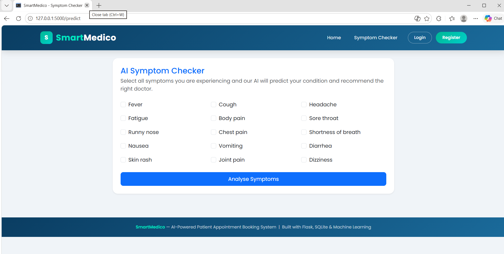
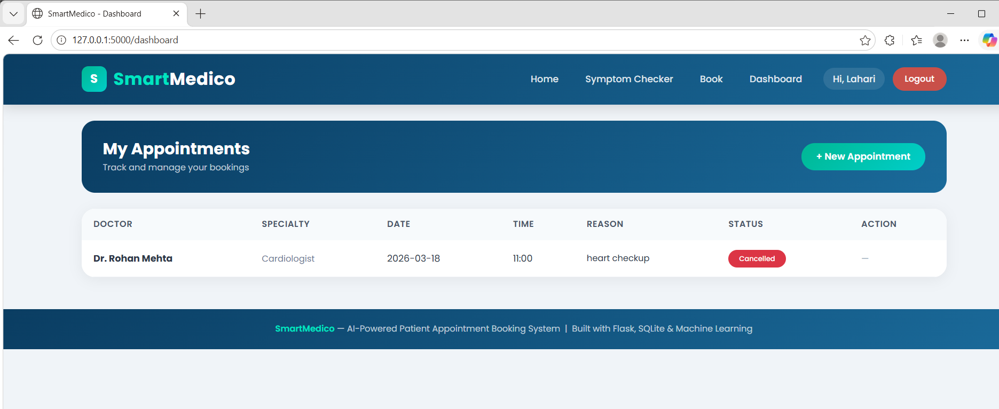
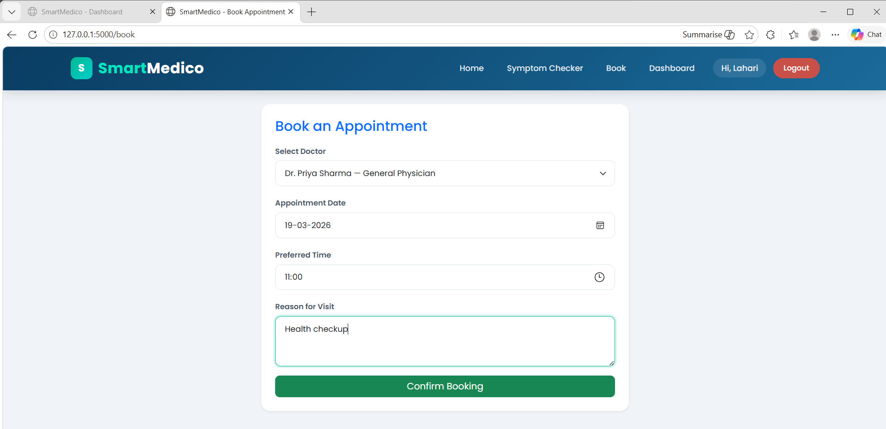

# SmartMedico - AI Patient Appointment Booking System


An intelligent full-stack web application that predicts diseases from symptoms using Machine Learning and enables patients to book doctor appointments online.

---

## Live Demo
> Run locally using setup instructions below

---

## Features

### Patient
- Register and login securely with password hashing
- AI Symptom Checker — predict disease from symptoms instantly
- Doctor recommendation based on predicted condition
- Book appointments with preferred doctor, date and time
- View and cancel appointments from personal dashboard

### Admin
- View all patient appointments in one place
- Confirm or cancel appointments
- Manage doctors — add and remove doctors
- No-show risk prediction for each pending appointment

### Machine Learning
- Disease prediction using Decision Tree Classifier (scikit-learn)
- Doctor recommendation based on specialty mapping
- Appointment no-show risk scoring based on booking patterns

---

## Screenshots

### Home Page


### Symptom Checker


### Dashboard


### Book Appointment


---

## Tech Stack

| Layer | Technology |
|---|---|
| Backend | Python, Flask |
| Frontend | HTML5, Bootstrap 5, jQuery, JavaScript |
| Database | SQLite |
| Machine Learning | scikit-learn (Decision Tree) |
| Templating | Jinja2 |
| Version Control | Git, GitHub |

---

## Project Structure
```
smartmedico/
├── model/
│   ├── train_model.py      # ML model training
│   ├── predict.py          # Prediction logic
│   └── model.pkl           # Trained model file
├── static/
│   ├── css/style.css       # Custom styles
│   └── js/script.js        # jQuery validations
├── templates/
│   ├── base.html           # Base layout
│   ├── index.html          # Home page
│   ├── register.html       # Registration page
│   ├── login.html          # Login page
│   ├── book.html           # Book appointment
│   ├── dashboard.html      # User dashboard
│   ├── predict.html        # Symptom checker
│   ├── noshow.html         # No-show prediction
│   ├── manage_doctors.html # Doctor management
│   └── success.html        # Booking success
├── app.py                  # Main Flask application
├── ml_model.py             # ML integration
└── requirements.txt        # Dependencies
```

---

## Setup Instructions

### 1. Clone the repository
```bash
git clone https://github.com/YOUR_USERNAME/smartmedico-appointment-system.git
cd smartmedico-appointment-system
```

### 2. Create virtual environment
```bash
python -m venv venv
venv\Scripts\activate
```

### 3. Install dependencies
```bash
pip install -r requirements.txt
```

### 4. Train the ML model
```bash
python model/train_model.py
```

### 5. Run the application
```bash
python app.py
```

### 6. Open in browser
```
http://127.0.0.1:5000
```

---

## Admin Access

| Field | Value |
|---|---|
| Email | admin@smartmedico.com |
| Password | admin123 |

---

## ML Model Details

| Feature | Algorithm | Input | Output |
|---|---|---|---|
| Disease Prediction | Decision Tree | 15 symptoms | Disease name |
| Doctor Recommendation | Specialty mapping | Disease name | Doctor list |
| No-show Prediction | Rule-based scoring | Date, time, lead days | Risk % |

---

## Author
**Lahari**
- GitHub: [@YOUR_USERNAME](https://github.com/YOUR_USERNAME)

---

## License
This project is open source and available under the MIT License.